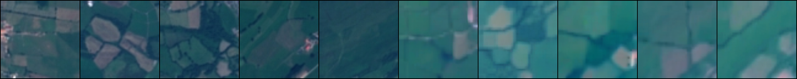
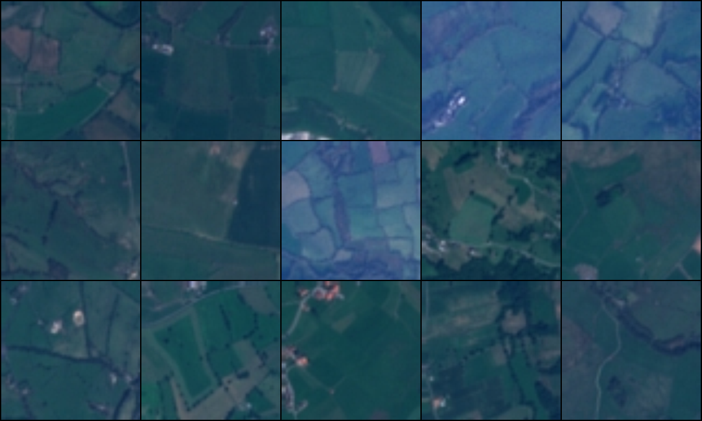

# Few-Shot Learning与LoRA图像生成融合研究报告

## 项目概述

本研究探索了在Few-Shot Learning任务中融合LoRA（Low-Rank Adaptation）生成图像的可行性与效果。我们设计并实现了一个完整的实验框架，包括任务图像生成、数据加载器、模型微调方法以及多种测试策略，旨在评估合成图像对少样本学习的潜在增益。

## 研究背景

Few-Shot Learning旨在解决数据稀缺问题，通过有限样本学习新任务的能力。传统方法仅依赖有限的支持集图像进行学习，训练数据不足导致过拟合风险。我们提出利用LoRA生成模型来扩充训练数据，产生与原始样本相似但具有一定变化的合成图像，以增强模型泛化能力。

## 技术方案

### 1. 数据处理与准备

#### 1.1 任务图像生成器

我们实现了`make_task_images`功能，用于从原始数据集中生成标准化的few-shot任务集：

- 生成指定数量的N-way K-shot任务
- 每个任务包含支持集、查询集和对应的LoRA图像
- 保持结构化存储，方便后续加载和测试
- 确保标签一致性和数据完整性

**图1：支持集图像与对应的LoRA生成图像对比**



*左边5张 展示了某一类别的支持集原始图像，右边是对应的LoRA生成图像。通过对比可以观察原始图像和生成图像在视觉特征上的异同。*

#### 1.2 FSL数据加载器实现

设计并实现了专用的Few-Shot Learning数据加载器：

- `FSLTaskLoader`：支持同时加载支持集、LoRA图像和查询集
- `OrderedTaskLoader`：确保任务按数字顺序正确加载
- 支持数据批处理和标签对齐
- 提供任务信息和元数据访问接口

**图2：查询集图像示例**



*图中展示了查询集中某一类别的图像示例，这些图像用于测试模型的泛化能力。*

#### 1.3 基于CLIP特征相似度的图像筛选机制

为提高LoRA生成图像的质量，我们实现了基于CLIP特征相似度的自动筛选系统：

- 使用`CLIPSimilarityCalculator`计算生成图像与原始支持集图像的语义相似度
- 设定相似度阈值（默认0.75），只保留高相似度的生成图像
- 对于不满足要求的图像自动重新生成，直到满足条件或达到最大尝试次数
- 通过这种方式确保合成图像在高层语义空间与原类别保持一致

```python
def filter_images(image_path, support_images_dir, image_prefix, similarity_threshold=0.75):
    # 使用CLIP计算与同类别support图像的相似度
    calculator = CLIPSimilarityCalculator()
    similarities = []
    for support_img_path in support_images:
        similarity = calculator.compute_similarity(image_path, support_img_path)
        similarities.append(similarity)
    
    # 使用平均相似度作为筛选标准    
    avg_similarity = sum(similarities) / len(similarities)
    return avg_similarity >= similarity_threshold
```

这种筛选机制极大地提升了生成图像的质量和相关性，理论上有助于减少"无关噪声"合成图像的负面影响。

### 2. 模型设计与改进

#### 2.1 基础模型架构

基于ResNet系列模型设计了适合Few-Shot Learning的微调框架：

- 预训练特征提取器作为backbone
- 可配置的冻结/训练模式
- 适配不同测试场景的分类头部设计

#### 2.2 微调策略创新

设计了多种微调策略以评估不同方法的效果：

1. **基础微调**（baseline）：冻结backbone，仅微调分类器fc层
2. **标准微调**（support_only）：使用支持集同时微调backbone和分类器
3. **LoRA微调**（lora_only）：仅使用LoRA图像进行微调
4. **混合微调**（normal）：同时使用支持集和LoRA图像微调
5. **渐进式融合微调**：三阶段微调策略，逐步引入LoRA图像
6. **三分支模块微调**：使用特殊的三分支架构处理支持集和LoRA图像

### 3. 实验设计与测试

#### 3.1 测试框架

构建了完整的测试管理框架（TestManager）：

- 支持多种测试模式和配置选项
- 自动化任务加载和测试流程
- 实现结果记录和日志管理
- 提供详细的进度和性能报告

#### 3.2 评估方法

- 使用5-way 5-shot设置进行测试
- 每种方法测试多个任务，计算平均准确率和标准差
- 对比不同微调策略的性能差异
- 评估LoRA图像质量对结果的影响

## 实验结果与分析

### 1. 性能对比

| 测试方法 | 准确率 |
|----------|--------|
| 只对support微调fc (baseline) | 85.89% |
| 逐步适应微调 (normal) | 80.45% |
| 逐步适应微调 (增加epoch到300) | 83.48% |
| 堆叠support和lora微调 | 74.64% |
| 只用support训练backbone和fc (support_only) | 83.64% |
| 只用lora微调 (lora_only) | 50.60% |
| 冻结backbone的lora微调 | 57.88% |
| 三分支模块微调 | 76.24% |

### 2. 关键发现

1. **预训练模型的特征提取能力表现优异**：
   - 只微调fc层的baseline方法获得最高准确率(85.89%)
   - 这表明预训练模型已具备良好的特征提取能力

2. **LoRA图像质量存在问题**：
   - 尽管实现了CLIP特征相似度筛选，仅使用LoRA图像的微调方法表现仍然最差(50.60%)
   - 即使是冻结backbone的版本准确率也只有57.88%
   - 这表明即使在语义空间上相似，生成的LoRA图像在某些关键特征上仍与原始图像存在差异

3. **混合策略优于纯LoRA但劣于纯支持集**：
   - 所有包含LoRA图像的方法准确率都低于仅使用支持集或基线方法
   - 这表明合成数据与真实数据存在分布差异，混合使用可能引入噪声

4. **增加训练轮次**的边际效益有限：
   - 将epoch从100增加到300只带来了3%左右的性能提升
   - 这表明模型收敛速度较快，长时间训练不一定带来显著增益

5. **复杂的微调策略不一定带来性能提升**：
   - 三分支模块和渐进式融合等复杂策略表现不如简单方法
   - 可能是由于增加了模型复杂度，反而导致过拟合

### 3. 分析与解释

1. **LoRA图像质量问题**：
   - 尽管使用了CLIP特征相似度筛选，当前的LoRA生成图像可能在局部特征或纹理细节上与原始图像存在差异
   - 语义相似不一定等同于判别性特征相似，模型可能依赖的判别特征在生成过程中丢失
   - 生成过程可能未充分捕捉类内变化，导致提供的学习信号有限

2. **预训练特征优势**：
   - 预训练模型已在大规模数据集上学习了丰富的特征表示
   - 对于当前测试的任务，这些特征已足够有效，微调backbone可能引入过拟合

3. **合成数据与真实数据的分布差异**：
   - 即使经过特征筛选，LoRA图像与真实图像的特征分布仍不一致，混合使用引入了噪声
   - 这种差异使模型难以学习统一的特征表示，降低了泛化能力

## 使用方法

本项目提供了多种测试模式和工具，下面是主要功能的使用方法说明：

### 1. 生成标准化任务图像集

```bash
# 进入项目目录
cd /path/to/project

# 生成任务图像（支持集、LoRA图像和查询集）
python test/generate_fixed_images.py
```

### 2. 运行不同测试模式

我们提供了四种测试模式，用于评估不同训练策略的效果：

```bash
# 1. 正常微调（支持集 + LoRA）
python test/Test_Metalearn_Finetune.py --n_way 5 --n_support 5 --n_query 15 --task_num 10 --mode normal

# 2. 只使用LoRA图像进行微调
python test/Test_Metalearn_Finetune.py --n_way 5 --n_support 5 --n_query 15 --task_num 10 --mode lora_only

# 3. 基准测试（冻结backbone，只微调分类器头）
python test/Test_Metalearn_Finetune.py --n_way 5 --n_support 5 --n_query 15 --task_num 10 --mode baseline

# 4. 只使用支持集图像进行完整微调（微调backbone和分类器头）
python test/Test_Metalearn_Finetune.py --n_way 5 --n_support 5 --n_query 15 --task_num 10 --mode support_only
```

参数说明：
- `--n_way`: 类别数量
- `--n_support`: 每类支持集样本数
- `--n_query`: 每类查询集样本数
- `--task_num`: 要测试的任务数量
- `--dataset`: 数据集名称 (默认: "EuroSAT")
- `--model_name`: 模型名称 (默认: "ResNet18")
- `--mode`: 测试模式 (normal/lora_only/baseline/support_only)

### 3. LoRA图像生成与筛选

为生成高质量的LoRA图像，我们实现了基于CLIP相似度的自动筛选系统：

```bash
# 生成并筛选LoRA图像
python utils/create_image.py
```

该脚本自动执行以下步骤：
1. 从`prompts.json`文件读取各类别的生成提示词
2. 为每个类别生成指定数量的候选图像
3. 使用CLIP计算每张生成图像与原始支持集图像的相似度
4. 只保留相似度高于阈值(默认0.75)的图像，不满足要求的会自动重新生成
5. 将筛选后的图像自动移动到`test/support_images/Lora_images`目录

### 4. 可视化与验证数据加载

```bash
# 验证数据加载是否正确
python test/load_complete_data.py
```

此脚本会加载支持集和查询集并显示示例图像，帮助验证数据加载是否正确。

## 结论与未来工作

### 主要结论

1. 在当前实验设置下，即使使用了CLIP特征相似度筛选，合成的LoRA图像仍无法有效提升Few-Shot Learning性能，甚至可能导致性能下降。
2. 最简单的方法（只微调分类器头）反而获得了最佳结果，表明复杂策略不一定适合所有场景。
3. 预训练模型的特征提取能力对于Few-Shot Learning任务已经相当强大。

### 未来工作方向

1. **进一步优化图像筛选机制**：
   - 调整CLIP相似度阈值，寻找最佳平衡点
   - 结合多种特征空间的相似度度量，如低级特征和高级特征的综合评估
   - 探索对抗性评估方法，使用判别器来区分高质量和低质量生成结果

2. **提高LoRA生成质量**：
   - 优化LoRA训练流程和参数设置
   - 增加训练步数和微调控制参数
   - 改进提示词策略以生成更高质量的图像

3. **改进融合策略**：
   - 开发特征级别的融合，而非直接混合训练数据
   - 实现动态权重调整机制，根据生成图像质量自动调整其影响力
   - 研究基于不确定性的样本选择机制

4. **领域适应性研究**：
   - 探索LoRA图像在不同领域和任务中的适用性
   - 研究特定领域的生成策略优化
   - 评估跨域转移学习中合成图像的价值

### 工作贡献总结

本研究建立了一个完整的实验框架，系统评估了LoRA生成图像在Few-Shot Learning中的应用效果。我们不仅实现了基于CLIP特征相似度的图像筛选机制，还设计了多种微调策略进行系统对比。虽然当前结果表明合成图像未能提升性能，但我们深入分析了可能的原因，并提出了多种改进方向。这些发现和分析为后续研究提供了宝贵的经验和技术基础。

## 附录：代码与实现

本项目实现了完整的实验框架，包括但不限于以下核心组件：

1. 数据加载与预处理
   - `FSLTaskLoader` - 专用于Few-Shot Learning的数据加载器
   - `OrderedTaskLoader` - 确保任务按数字顺序加载

2. 模型与微调方法
   - `FineTuningModel` - 支持多种微调策略的模型类
   - 多种微调函数：`fine_tune`, `lora_only_fine_tune`, `baseline_test`, `support_only_fine_tune`

3. 测试与评估
   - `TestManager` - 综合测试管理框架
   - 多种测试模式的实现与比较

4. LoRA图像生成与筛选
   - 基于CLIP的特征相似度计算
   - 自动化图像质量评估与筛选
   - 提示词管理与优化 